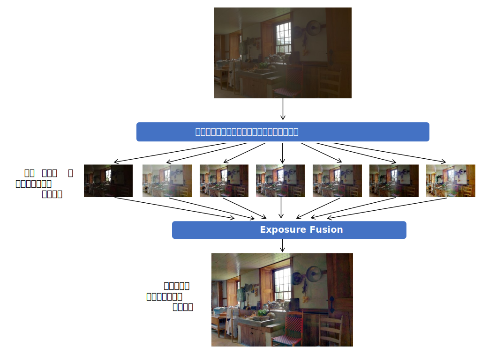
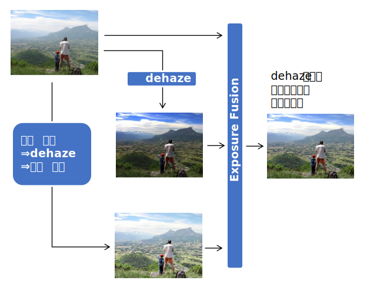

<html lang="ja">
    <head>
        <meta charset="utf-8" />
    </head>
    <body>
        <h1>
Exposure Fusion
</h1>
        <h2>なにものか？</h2>
        

            多段階露出(Exposure Bracketing)された画像群を融合した画像を生成します。 
            <a href="https://www.researchgate.net/profile/Tom-Mertens/publication/4295602_Exposure_Fusion/links/53f716940cf2888a7497691d/Exposure-Fusion.pdf
">Exposure Fusion (2007)</a> 
            
             
            色々なパラメータで補正した画像群から "いいとこ取り" 画像を作るのにも使えます。 
             
             
            
        

        <h2>環境構築方法</h2>
        

            pip install opencv-python 
        

        <h2>使い方</h2>
        

            python  exposure_fusion.py  (画像ファイル１)  (画像ファイル２) ･･･ 
            例) python exposure_fusion.py A.jpg B.jpg C.jpg D.jpg 
             
            または 
             
            python  exposure_fusion.py (画像群に対するワイルドカード) 
            例) python exposure_fusion.py *.jpg 
             
            実行すると融合画像が表示され、ESCキーを押下すると終了し、融合画像が fusion.png に保存されます。 
        

    </body>
</html>
